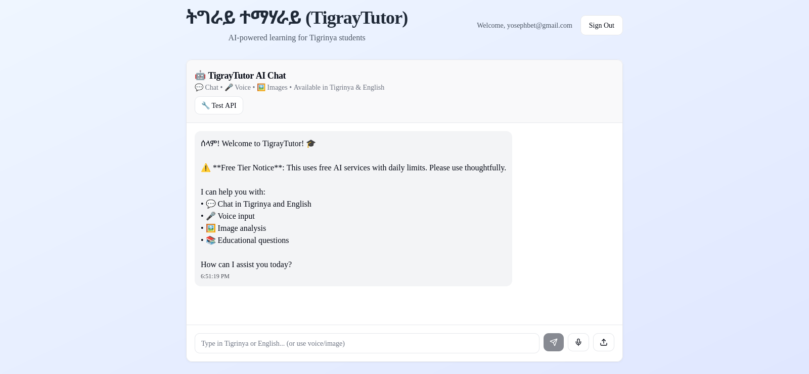

# TigrayTutor - ትግራይ ተማሃራይ

<div align="center">
  
  
  [](https://tigray-tutor-ai.vercel.app)
  [](https://github.com/yosephdev/tigray-tutor-ai)
  [](LICENSE)
</div>

---

TigrayTutor is an AI-powered educational platform designed specifically for Tigrinya-speaking students, providing personalized tutoring aligned with the Ethiopian curriculum.

## 🌐 Live Demo

**🔗 [Try TigrayTutor Live](https://tigray-tutor-ai.vercel.app)**

*Experience the power of AI-driven education in Tigrinya language!*

## 🌟 Features

### Core Functionality

- 🗣️ **Primary interface in Tigrinya language** - Native language learning experience
- 🤖 **AI-powered tutoring system** - Intelligent responses using Google Gemini AI
- 📚 **Ethiopian curriculum alignment** - Content tailored to local educational standards
- 📱 **Offline-first capabilities** - Learn even without internet connection
- 🔄 **Tigrinya-English translation** - Seamless bilingual support
- 🎤 **Voice interaction support** - Natural conversation with AI tutor
- 📑 **PDF lesson upload and processing** - Upload and analyze educational materials
- 💬 **Interactive chat functionality** - Real-time AI tutoring conversations

### Technical Features

- ⚡ **Built with Next.js 14** - Modern, fast, and scalable
- 🔐 **Supabase authentication & database** - Secure user management
- 🧠 **Google Gemini AI integration** - Advanced AI capabilities
- 📱 **Responsive design** - Works perfectly on all devices
- 🌐 **Low-bandwidth optimized** - Accessible in areas with poor connectivity
- 🌙 **Dark/light mode support** - Comfortable viewing in any environment

## 🎯 Target Users

- **Primary Users**: Tigrinya-speaking students in Ethiopia and Eritrea
- **Secondary Users**: Teachers and educational institutions in Tigray region
- **Global Users**: Tigrinya diaspora communities worldwide

## 📱 UI/UX Features

- Clean, intuitive interface designed for students
- Easy navigation between subjects and lessons
- Progress tracking dashboard with visual analytics
- Interactive exercises section with immediate feedback
- Culturally relevant design elements and content
- Mobile-responsive layouts for smartphone learning
- Offline content access for uninterrupted learning
- Dark/light mode toggle for comfortable studying

## 🛠️ Tech Stack

- **Frontend**: Next.js 14, TypeScript
- **Authentication & Database**: Supabase
- **AI Integration**: Google Gemini API
- **Styling**: Tailwind CSS, DaisyUI
- **UI Components**: Radix UI
- **Charts**: Recharts
- **Date Handling**: date-fns
- **Deployment**: Vercel

## 🔄 Offline Functionality

- Lesson content caching for offline access
- Offline exercise completion and sync
- Progress tracking with automatic sync when online
- Automatic content updates when connection is restored

## 💡 AI Model Information

Currently using **Google Gemini Flash** model for AI responses. 

> **Note**: If financial conditions allow, I plan to upgrade to unlimited Gemini Pro models for enhanced AI capabilities, faster responses, and better educational content generation. Your support and contributions can help make this possible!

## 🚀 Getting Started

### Prerequisites

- Node.js 18+ installed
- Google Gemini API key
- Firebase project setup
- Supabase account (optional)

### Installation

1. **Clone the repository**
   ```bash
   git clone https://github.com/yosephdev/tigray-tutor-ai.git
   cd tigray-tutor-ai
   ```

2. **Install dependencies**
   ```bash
   npm install
   ```

3. **Set up environment variables**
   ```bash
   cp .env.example .env.local
   # Add your API keys and configuration
   ```

4. **Run the development server**
   ```bash
   npm run dev
   ```

5. **Open [http://localhost:3000](http://localhost:3000)** in your browser

## 📈 Future Enhancements

- [ ] Advanced voice recognition with Tigrinya speech-to-text
- [ ] Peer-to-peer learning features and study groups
- [ ] Video lesson support with Tigrinya subtitles
- [ ] Parent/teacher dashboard for progress monitoring
- [ ] Advanced performance analytics and insights
- [ ] Content creation tools for teachers
- [ ] Mobile app for iOS and Android
- [ ] Integration with Ethiopian Ministry of Education curriculum
- [ ] Gamification features and achievement system
- [ ] Multi-language support (Amharic, Oromo, etc.)

## 🤝 Contributing

We welcome contributions from the community! Please read our [Contributing Guidelines](CONTRIBUTING.md) for details on:

- Code of conduct
- Development process
- How to submit pull requests
- Issue reporting guidelines
- Community standards

## 📄 License

This project is licensed under the MIT License - see the [LICENSE](LICENSE) file for details.

## 📞 Support & Contact

- **Email**: [contact@yoseph.dev](mailto:contact@yoseph.dev)
- **GitHub Issues**: [Report bugs or request features](https://github.com/yosephdev/tigray-tutor-ai/issues)
- **Discussions**: [Join community discussions](https://github.com/yosephdev/tigray-tutor-ai/discussions)

## 🙏 Acknowledgments

- **Tigray Educational Community** - For inspiration and feedback
- **Google Gemini AI** - For providing advanced AI capabilities
- **Open Source Community** - For the amazing tools and libraries
- **Beta Testers** - For valuable feedback and bug reports

## 📊 Project Status

- ✅ **Core Features**: Implemented and working
- ✅ **AI Integration**: Google Gemini API integrated
- ✅ **Responsive Design**: Mobile and desktop optimized
- 🔄 **Offline Support**: In development
- 🔄 **Voice Features**: Planned for next release
- 🔄 **Mobile App**: Future roadmap

---

<div align="center">
  <strong>Built with ❤️ for the Tigray educational community</strong>
  
  <br><br>
  
  **ንትግራይ ህዝቢ ትምህርቲ ብፍቕሪ ተሰሪሑ**
</div>
